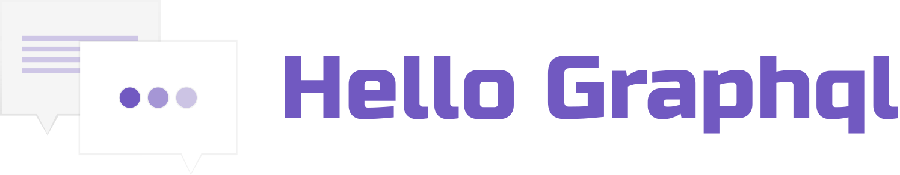
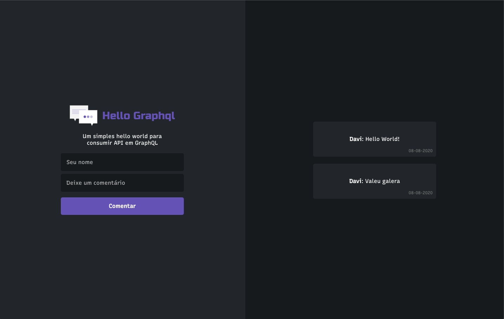

<h1 align="center">
    
</h1>

<p align="center">
  <a href="https://github.com/daviseares/hello-graphql/commits/master">
    
  </a>

  

  

  
</p>

<br>

<p align="center">
  
</p>
<p align="center">
 <a href="" target="_blank">See the video</a>
</p>

## 🚀 Tecnologias

Entre as tecnologias utilizadas, destaca-se:
- [GraphQL](https://graphql.org/)
- [Apollo Server](https://www.apollographql.com/docs/react/)
- [MongoDB](https://www.mongodb.com/)
- [Styled Components](https://www.typescriptlang.org/)
- [TypeScript](https://www.typescriptlang.org/)
- [Yarn](https://expo.io/)


### 💻 Installation

#### web

```bash
# Clone this repository
$ git clone https://github.com/daviseares/hello-graphql.git

# Go into the repository
$ cd web

# Install dependencies
$ yarn

# Run
$ yarn start
```

#### server

Before, copy and rename .envexemple to .env and set mongo db. [Read more](https://docs.mongodb.com/manual/reference/connection-string/)
```env
# Mongo
MONGO_URL= //mongo.db url here

```


```bash
# Clone this repository
$ git clone https://github.com/daviseares/hello-graphql.git

# Go into the repository
$ cd server

# Install dependencies
$ yarn

# Run
$ yarn dev
 
```


## 🤔 Como contribuir

- Faça um fork desse repositório;
- Cria uma branch com a sua feature: `git checkout -b minha-feature`;
- Faça commit das suas alterações: `git commit -m 'feat: Minha nova feature'`;
- Faça push para a sua branch: `git push origin minha-feature`.

Depois que o merge da sua pull request for feito, você pode deletar a sua branch.

## :memo: Licença

Esse projeto está sob a licença MIT. Veja o arquivo [LICENSE](LICENSE.md) para mais detalhes.

---

Feito com ♥ &nbsp;by Davi Borges.

